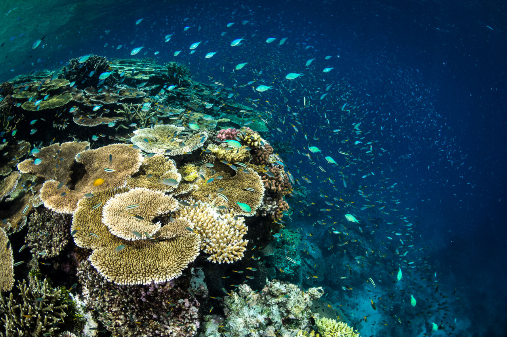

# Coral Image Classification
A CNN-based image classification model to accurately identify and monitor the health of coral reefs.



## Problem
Coral reefs are vital to marine life: 
* Protects coastlines from weather damage
* Shelters at least 25% marine species
* Provide human resources for a plethora of industries.

Coral reefs are one of the most vulnerable ecosystems on Earth:
* Half of the world's coral reefs have died
* Coral bleaching occurs due to rising ocean temperatures and other environmental factors

### Challenges
* Manual identification of bleached and healthy corals is time-consuming 
* Requires specialized knowledge and continuous monitoring 

## Solution
CNN-based image classification model 
* Automates labor-intensive process with accurate classification
* Uses large dataset of labeled coral images for learning and training
* Produces a more efficient, consistent, and scalable approach

### Application
* Large-scale, real-time coral reef monitoring 
* Underwater camera systems or aerial imagery


### Purpose
* To assist marine researchers, biologists, and data scientists in identifying healthy and bleached corals based on distinct visual patterns. 
* To better understand the health of coral reefs, monitoring changes within ecosystems and contributing to the conservation & restoration strategies.
* To raise public awareness about the importance of coral reef ecosystems and the hardships they face.

<!-- Addition Visuals: TTYGIF or ASCIINEMA -->
## Installation
1. Clone the respository:
   ```bash
   git clone https://github.com/brittnyn/coral_image_classification
   cd your-repo
   ```

2. Create a virtual environment (highly recommended):
    ```bash
    python -m venv cnn-env
    source cnn-env/bin/activate # Mac/Linux
    ```

    ```bash
    python -m venv cnn-env
    cnn-env\Scripts\activate # Windows 
    ```

3. Install the required packages
    ```bash
    pip install numpy pandas matplotlib opencv-python seaborn tensorflow 
    ```
4. Switch to Jupyter Kernel in VS Code (if needed)  
    a. Pip install `ipykernel` for Jupyter Notebook extension in VS Code. 
    b. Open .ipynb notebook file inside VS Code  
    c. Select Kernel at the top-right corder of the editor  
    d. Select Python Environments \rightarrow Choose environment labelled `cnn-env`  
    e. Or, select create python environment (\rightarrow Enter interpreter path \rightarrow Manually browse for the path)  

### Additional Notes
<!-- Programming language version, operating system, or dependencies that have to be installed manually -->
* At most Python v.3.13 for compatibility with TensorFlow
* Using a virtual environment isolates program from global package
* Run cells from top to bottom using a GPU accelerator


## Roadmap
<!-- Possible ideas for the future: -->
* Use a more modern model
* Expand curated dataset
* Use real-world examples from videos 
* Expand to visualized GUI
* Integrate with other marine technologies

## License
This project is licensed under the MIT License - see the [LICENSE](LICENSE) file for details.

